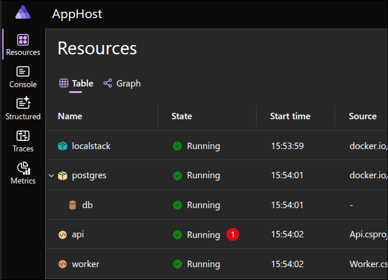
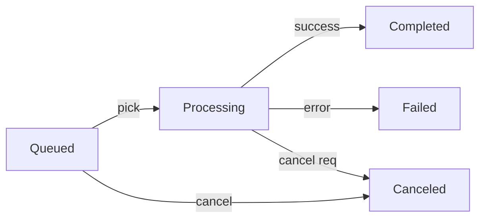
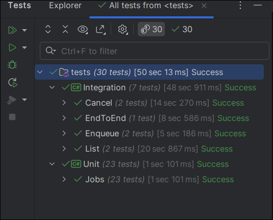

# BG Backend Challenge

This project implements a job queue system where users can submit image processing jobs via REST API. Aside from the original challenge, the author also imposed some self-defined constraints:

* **Aspire**: The goal of using .NET Aspire 9.3 is to setup everything locally, so reviewer can have an easy time and run the entire system with a single F5.
* **No third party queues**: The spec does not exclusively mention using any advanced queue solutions like Azure Service Bus or Kafka, let's try to solve this puzzle without one.
* **No polling**: I absolutely loathe polling unless it is the only choice available.

## Prerequisites

This solution was developed with the following:

* .NET 9.0.106 SDK
* Podman v5.5.2 (*Docker should be fine too*)
* .NET Aspire 9.3
* Rider 2025.1.2
* CachyOS 6.15.7-3

Any other configuration except above are not tested, feel free to open an issue if you have trouble setting it up.

### Quickstart

1. Clone the repository:

    ```bash
    git clone https://github.com/Mithgroth/bg-challenge.git
    cd bg-challenge
    ```

2. Start the application using Aspire:

    ```bash
    cd aspire/AppHost
    dotnet run
    ```

This will start:

* PostgreSQL database container
* LocalStack (S3-compatible storage)
* API service (port 7182)
* Background Worker service
* Aspire dashboard for monitoring

The Aspire dashboard will be available at the URL shown in the console output, typically `https://localhost:17010`.

You should be seeing a dashboard similar to this:



If this is your first time running the application, Api will throw a warning which can be safely ignored, about EF Migrations table missing.

### Running Tests

```bash
# Run unit tests
dotnet test tests/Unit/

# Run integration tests
dotnet test tests/Integration/
```

## Decisions & Tradeoffs

* Queue & Locking
  * PostgreSQL `LISTEN/NOTIFY` instead of an external queue. One DB, no dual write, no polling.
  * Each claimed job gets a `LockKey` (bigint). Worker calls `pg_advisory_lock(LockKey)` on the same connection.
  * Crash frees the session lock automatically. Row still holds `LockKey`.
  * On restart: for every `Processing` row, try `pg_try_advisory_lock(LockKey)`.  
    * true ⇒ nobody owns it ⇒ free orphans  
    * false ⇒ another worker is processing it ⇒ skip

* Timing & Concurrency
  * Use `Stopwatch.GetTimestamp()` for precise durations, not `DateTime.UtcNow` to avoid OS calls.
  * Status updates rely on optimistic patterns. No heavy DB locking beyond the short claim phase.

* Error Strategy
  * Transient errors (network, S3 hiccups) are retried with backoff.
  * Permanent errors (bad URL, 415 content type) mark the job as `Failed` immediately.

* API & Responsibilities
  * API only validates input and persists the job. Worker does the actual work.
  * If it were my call, I would keep the `Enqueue` request open and pass a `CancellationToken` to support cancellation (*the usual .NET way*). The spec forced an async 202 flow with a separate cancel endpoint, so we: set `CancelRequested` (or mark `Canceled` if still queued), send a `NOTIFY`, and the worker stops itself using its own token.
  * Minimal APIs bind a single object. Arrays would not match the parameter, so enqueue stays singular.
  * [`SignHere`](https://github.com/Mithgroth/SignHere) (*my lib*) helper lib was used to validate image files by their magic bytes. As a developer, I'm terrified at the idea of trusting `Content-Type` header in public internet.

* Assumptions
  * Jobs are idempotent enough to retry safely.
  * Target is local dev and review experience first, not max throughput.
  * Expected sustained load is well under a thousand jobs per second.

## Overview

### Technology Stack

| Component | Technology | Rationale |
|-----------|------------|-----------|
| **Runtime** | .NET 9 | Because it is .NET |
| **Orchestration** | Aspire 9.3 | Modern .NET cloud orchestration with built-in observability |
| **Database** | PostgreSQL | Wish SQL Server was good as half |
| **Message Queue** | PostgreSQL LISTEN/NOTIFY | Eliminates external dependencies while providing reliable pub/sub |
| **Blob Storage** | LocalStack S3 | AWS S3-compatible local development environment |
| **Testing** | [TUnit](https://tunit.dev/) | Modern, performant testing framework with async support |
| **API Style** | Minimal APIs | Lightweight, high-performance HTTP APIs with Vertical Slice Architecture |

### Project Structure

```text
/
├─ aspire/
│  ├─ AppHost/           # Aspire orchestration host
│  └─ ServiceDefaults/   # Shared Aspire configuration
├─ src/
│  ├─ Domain/            # Stateless business logic and entities
│  ├─ Api/               # REST API using Minimal APIs
│  └─ Worker/            # Background job processing service
└─ tests/
   ├─ Unit/              # Fast unit tests for Domain layer
   └─ Integration/       # End-to-end integration tests
```

This architecture promotes clean separation of concerns while maintaining simplicity. The Domain layer contains no infrastructure dependencies, making it easily testable and portable across different hosting environments.

### API Reference

#### Enqueue Job

Submit a new background job for processing.

```http
POST /results/enqueue
Content-Type: application/json

{
  "jobId": "e5819e7d-cb04-4f18-863c-c9166dfcadf5",
  "type": "test",
  "imgUrl": "https://upload.wikimedia.org/wikipedia/commons/4/4a/OzzyChangingHands02-20-2010.jpg"
}
```

**Response**: `202 Accepted`

```json
{
  "jobId": "e5819e7d-cb04-4f18-863c-c9166dfcadf5",
  "type": "test",
  "imgUrl": "https://upload.wikimedia.org/wikipedia/commons/4/4a/OzzyChangingHands02-20-2010.jpg",
  "status": "Queued",
  "createdAt": 25131664577734
}
```

#### List Jobs

Retrieve all jobs with their current status.

```http
GET /results/list
```

**Response**: `200 OK`

```json
[
  {
    "jobId": "e5819e7d-cb04-4f18-863c-c9166dfcadf5",
    "type": "test",
    "imgUrl": "https://upload.wikimedia.org/wikipedia/commons/4/4a/OzzyChangingHands02-20-2010.jpg",
    "status": "Completed",
    "resultFile": "OzzyChangingHands02-20-2010.jpg",
    "createdAt": 25131664577734,
    "updatedAt": 25137417264738,
    "durationMs": 5752
  }
]
```

#### Cancel Job

Request cancellation of a job.  
If it is queued it is canceled immediately.  
If it is processing the worker will stop soon.

```http
POST /results/{id}/cancel
```

**Response**: `200 OK`

```json
{
  "jobId": "e5819e7d-cb04-4f18-863c-c9166dfcadf5",
  "status": "Canceled"
}
```

### Job Status Flow



### Testing Approach

The project uses a comprehensive testing strategy with both unit and integration tests:

#### Unit Tests

* Target the Domain layer exclusively
* Use TUnit for fast, parallelized execution
* Focus on business logic validation
* No external dependencies or I/O (**important**)

#### Integration Tests

* Full system testing using Aspire test host, real PostgreSQL and LocalStack containers, mock **nothing**
* End-to-end user journey validation
* Tests (*tries to*) handle timing issues inherent in async processing
* Loosely coupled with infrastructure or code to enable quick changes for the future, just call the endpoint, see if the outcome is the expected one - best used as sanity checks

#### Test Conventions

* Test class names are concise user-journey nouns (e.g., `List`, `Enqueue`)
* Method names are camel-cased boolean phrases (`CanRespond`, `IsIdempotent`)
* Global test fixtures minimize container startup overhead
* Not claiming this is the best approach ever, but for my own experience this is better than `List_Endpoint_Can_Actually_List_Something_When_It_Is_I_Already_Forgot`



## Potential Improvements

### Production Readiness

* **Observability**: Add structured logging, metrics, and distributed tracing
* **Security**: Implement authentication, input validation, and rate limiting
* **Scalability**: Consider dedicated message brokers for high-throughput scenarios
* **Resilience**: Add retry policies, circuit breakers, and dead letter queues

### Feature Enhancements

* **`System.Threading.Channels`**: This design might play well with C#'s own channels, idea might be worth exploring
* **Job Prioritization**: Add priority queues for urgent jobs
* **Batch Processing**: Support bulk job submission and processing
* **Job Scheduling**: Add delayed execution and cron-like scheduling
* **Result Storage**: Implement configurable storage backends (S3, Azure Blob)
* **Lock Improvements**: Add a time threshold for checking locks on "Queued" jobs to avoid having to process many jobs after a long downtime (*been there once, wasn't a pleasant day*).

### Developer Experience

* **API Documentation**: Add OpenAPI/Swagger documentation
* **Local Tooling**: Create CLI tools for job management and debugging
* **Performance Testing**: Add load testing with realistic job workloads and better metrics / logging
